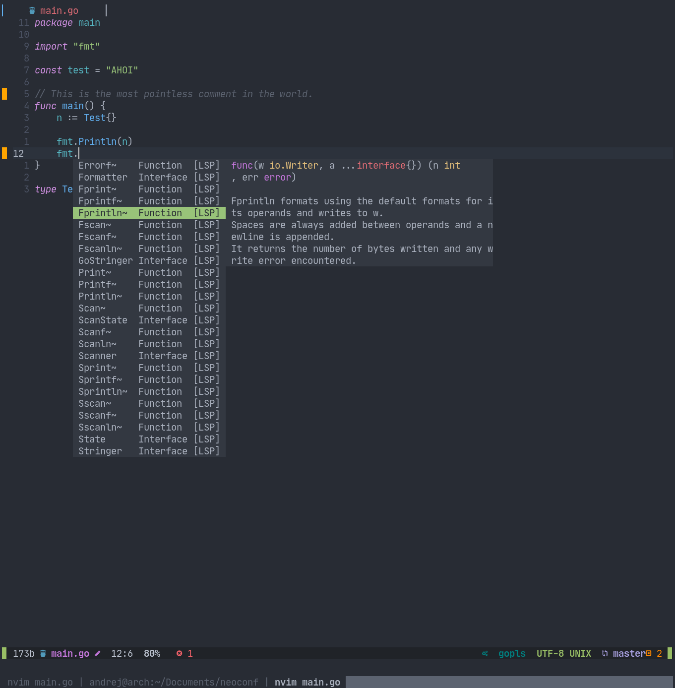

# Personal Neovim config
## Features
 - Native LSP
 - Autocompletion via [nvim-compe](https://github.com/hrsh7th/nvim-compe)
 - Treesitter highlighting
 - [Telescope](https://github.com/nvim-telescope/telescope.nvim) Fuzzy-Find (....and a ton more!!)
 - [Tree](https://github.com/kyazdani42/nvim-tree.lua) File-Tree
 - [Gitsigns](https://github.com/lewis6991/gitsigns.nvim) for in-file Git information
 - [Lazgit](https://github.com/kdheepak/lazygit.nvim) for handling Git
 - various other stuff :-)

## Installation

`git clone https://github.com/abenz1267/nvim ~/.config/`

Packer will be installed automatically, just havea to run: `:PackerInstall` to install all the plugins.

`:TSUpdate` will install all Treesitter-Parsers

`luarocks install --server=https://luarocks.org/dev luaformatter`

